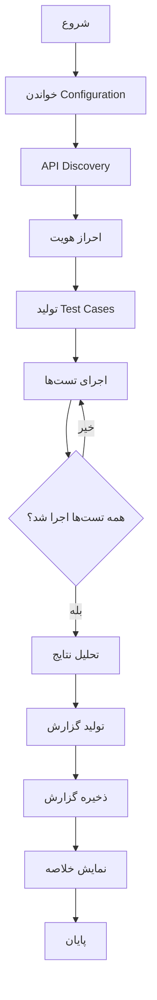

# Design Document

## Overview

این سند طراحی یک سیستم جامع تست و اعتبارسنجی APIها برای سیستم CRM و ماژول SaaS را ارائه می‌دهد. سیستم به صورت خودکار تمام APIهای موجود در سه بخش اصلی (API Routes، Secret Zone، Dashboard) را شناسایی، تست، و گزارش‌دهی می‌کند.

### اهداف طراحی

1. **خودکارسازی کامل**: تست تمام APIها بدون نیاز به دخالت دستی
2. **گزارش‌دهی جامع**: ارائه گزارش دقیق از وضعیت هر API
3. **قابلیت توسعه**: امکان افزودن تست‌های جدید به راحتی
4. **عملکرد بالا**: اجرای سریع تست‌ها با استفاده از concurrent requests
5. **مستندسازی خودکار**: تولید مستندات API به صورت خودکار

## Architecture

### معماری کلی

```
┌─────────────────────────────────────────────────────────────┐
│                    API Testing System                        │
├─────────────────────────────────────────────────────────────┤
│                                                               │
│  ┌──────────────┐  ┌──────────────┐  ┌──────────────┐      │
│  │   API        │  │   Test       │  │   Report     │      │
│  │   Discovery  │─▶│   Runner     │─▶│   Generator  │      │
│  └──────────────┘  └──────────────┘  └──────────────┘      │
│         │                  │                  │              │
│         ▼                  ▼                  ▼              │
│  ┌──────────────┐  ┌──────────────┐  ┌──────────────┐      │
│  │   Route      │  │   Auth       │  │   Results    │      │
│  │   Parser     │  │   Manager    │  │   Storage    │      │
│  └──────────────┘  └──────────────┘  └──────────────┘      │
│                                                               │
└─────────────────────────────────────────────────────────────┘
                            │
                            ▼
        ┌───────────────────────────────────────┐
        │         Target APIs                    │
        ├───────────────────────────────────────┤
        │  /api/*  │  /secret-zone/*  │  /tenant/*│
        └───────────────────────────────────────┘
```

### لایه‌های سیستم

#### 1. API Discovery Layer
- اسکن خودکار فولدرهای API
- شناسایی route handlers
- استخراج متدهای HTTP
- تشخیص نیاز به احراز هویت

#### 2. Test Execution Layer
- مدیریت احراز هویت
- اجرای درخواست‌های HTTP
- مدیریت tenant context
- اندازه‌گیری زمان پاسخ

#### 3. Validation Layer
- بررسی کدهای وضعیت
- اعتبارسنجی ساختار پاسخ
- بررسی داده‌های برگشتی
- تست امنیت

#### 4. Reporting Layer
- ذخیره نتایج تست
- تولید گزارش HTML/JSON
- نمایش آمار
- لیست مشکلات

## Components and Interfaces

### 1. API Discovery Component

```typescript
interface APIEndpoint {
  path: string;
  method: 'GET' | 'POST' | 'PUT' | 'DELETE' | 'PATCH';
  requiresAuth: boolean;
  requiresTenant: boolean;
  category: 'api' | 'secret-zone' | 'tenant' | 'dashboard';
  description?: string;
}

interface DiscoveryConfig {
  scanPaths: string[];
  excludePatterns: string[];
  includePatterns: string[];
}

class APIDiscovery {
  async scanAPIs(config: DiscoveryConfig): Promise<APIEndpoint[]>;
  async parseRouteFile(filePath: string): Promise<APIEndpoint[]>;
  async categorizeEndpoint(path: string): Promise<string>;
}
```

### 2. Authentication Manager

```typescript
interface AuthCredentials {
  email: string;
  password: string;
  type: 'admin' | 'tenant' | 'user';
}

interface AuthToken {
  token: string;
  expiresAt: Date;
  userId: string;
  tenantKey?: string;
}

class AuthManager {
  async login(credentials: AuthCredentials): Promise<AuthToken>;
  async refreshToken(token: string): Promise<AuthToken>;
  async getTenantToken(tenantKey: string): Promise<AuthToken>;
  async getAdminToken(): Promise<AuthToken>;
  isTokenValid(token: AuthToken): boolean;
}
```

### 3. Test Runner

```typescript
interface TestCase {
  endpoint: APIEndpoint;
  method: string;
  headers: Record<string, string>;
  body?: any;
  expectedStatus: number[];
  validateResponse?: (response: any) => boolean;
}

interface TestResult {
  endpoint: string;
  method: string;
  status: 'passed' | 'failed' | 'error';
  statusCode: number;
  responseTime: number;
  error?: string;
  response?: any;
  timestamp: Date;
}

class TestRunner {
  async runTest(testCase: TestCase): Promise<TestResult>;
  async runBatch(testCases: TestCase[]): Promise<TestResult[]>;
  async runConcurrent(testCases: TestCase[], concurrency: number): Promise<TestResult[]>;
}
```

### 4. Test Suite Generator

```typescript
interface TestSuiteConfig {
  endpoints: APIEndpoint[];
  authTokens: Map<string, AuthToken>;
  testData: TestDataProvider;
}

class TestSuiteGenerator {
  async generateTests(config: TestSuiteConfig): Promise<TestCase[]>;
  async generateCRUDTests(endpoint: APIEndpoint): Promise<TestCase[]>;
  async generateAuthTests(endpoint: APIEndpoint): Promise<TestCase[]>;
  async generateValidationTests(endpoint: APIEndpoint): Promise<TestCase[]>;
}
```

### 5. Report Generator

```typescript
interface TestReport {
  summary: {
    total: number;
    passed: number;
    failed: number;
    errors: number;
    duration: number;
  };
  results: TestResult[];
  failedTests: TestResult[];
  slowTests: TestResult[];
  categories: Map<string, TestResult[]>;
}

class ReportGenerator {
  async generateReport(results: TestResult[]): Promise<TestReport>;
  async exportHTML(report: TestReport, outputPath: string): Promise<void>;
  async exportJSON(report: TestReport, outputPath: string): Promise<void>;
  async exportMarkdown(report: TestReport, outputPath: string): Promise<void>;
}
```

## Data Models

### Test Configuration

```typescript
interface TestConfig {
  baseUrl: string;
  timeout: number;
  retries: number;
  concurrency: number;
  
  auth: {
    adminEmail: string;
    adminPassword: string;
    testTenantKey: string;
    testUserEmail: string;
    testUserPassword: string;
  };
  
  testData: {
    sampleCustomer: any;
    sampleDeal: any;
    sampleTask: any;
    sampleProduct: any;
  };
  
  validation: {
    maxResponseTime: number;
    requiredHeaders: string[];
    securityChecks: boolean;
  };
}
```

### Test Data Provider

```typescript
interface TestDataProvider {
  getCustomerData(): any;
  getDealData(): any;
  getTaskData(): any;
  getProductData(): any;
  getRandomEmail(): string;
  getRandomPhone(): string;
  cleanup(): Promise<void>;
}

class TestDataManager implements TestDataProvider {
  private createdIds: Map<string, string[]>;
  
  async getCustomerData(): Promise<any>;
  async getDealData(): Promise<any>;
  async cleanup(): Promise<void>;
}
```

## Testing Strategy

### 1. تست‌های CRUD

برای هر endpoint که عملیات CRUD دارد:

```typescript
// CREATE Test
POST /api/customers
- با داده‌های معتبر → انتظار 201
- با داده‌های نامعتبر → انتظار 400
- بدون احراز هویت → انتظار 401

// READ Test
GET /api/customers
- لیست تمام رکوردها → انتظار 200
- با pagination → انتظار 200
- با فیلتر → انتظار 200
- رکورد خاص → انتظار 200
- رکورد نامعتبر → انتظار 404

// UPDATE Test
PUT /api/customers/:id
- با داده‌های معتبر → انتظار 200
- با داده‌های نامعتبر → انتظار 400
- رکورد نامعتبر → انتظار 404

// DELETE Test
DELETE /api/customers/:id
- رکورد موجود → انتظار 200
- رکورد نامعتبر → انتظار 404
```

### 2. تست‌های احراز هویت

```typescript
// Login Tests
POST /api/auth/login
- اطلاعات صحیح → انتظار 200 + token
- اطلاعات نادرست → انتظار 401
- فیلدهای خالی → انتظار 400

// Protected Endpoint Tests
GET /api/customers
- با token معتبر → انتظار 200
- بدون token → انتظار 401
- با token منقضی شده → انتظار 401
- با token نامعتبر → انتظار 401
```

### 3. تست‌های Tenant Isolation

```typescript
// Tenant Context Tests
GET /api/tenant/customers (با tenant_key: tenant1)
- باید فقط داده‌های tenant1 را برگرداند

GET /api/tenant/customers (با tenant_key: tenant2)
- باید فقط داده‌های tenant2 را برگرداند

// Cross-Tenant Access Tests
- تلاش برای دسترسی به داده‌های tenant دیگر → انتظار 403
```

### 4. تست‌های عملکرد

```typescript
// Response Time Tests
- اندازه‌گیری زمان پاسخ هر API
- شناسایی APIهای کند (> 2 ثانیه)
- تست تحت بار (concurrent requests)

// Load Tests
- ارسال 100 درخواست همزمان
- بررسی rate limiting
- بررسی پایداری سیستم
```

### 5. تست‌های امنیت

```typescript
// Security Tests
- SQL Injection: ارسال ' OR '1'='1
- XSS: ارسال <script>alert('xss')</script>
- Authorization: تلاش برای دسترسی به منابع دیگران
- CSRF: بررسی توکن‌های CSRF
- Rate Limiting: ارسال درخواست‌های متعدد
```

## Error Handling

### استراتژی مدیریت خطا

```typescript
class TestError extends Error {
  constructor(
    message: string,
    public endpoint: string,
    public statusCode?: number,
    public response?: any
  ) {
    super(message);
  }
}

class ErrorHandler {
  handleTestError(error: TestError): TestResult {
    return {
      endpoint: error.endpoint,
      method: 'UNKNOWN',
      status: 'error',
      statusCode: error.statusCode || 0,
      responseTime: 0,
      error: error.message,
      response: error.response,
      timestamp: new Date()
    };
  }
  
  handleNetworkError(error: Error, endpoint: string): TestResult;
  handleTimeoutError(endpoint: string): TestResult;
  handleAuthError(endpoint: string): TestResult;
}
```

### انواع خطاها

1. **Network Errors**: مشکل در اتصال به سرور
2. **Timeout Errors**: زمان پاسخ بیش از حد مجاز
3. **Auth Errors**: مشکل در احراز هویت
4. **Validation Errors**: پاسخ نامعتبر از API
5. **Database Errors**: مشکل در اتصال به دیتابیس

## Implementation Details

### ساختار فایل‌ها

```
scripts/
  api-testing/
    ├── index.ts                 # Entry point
    ├── config.ts                # Configuration
    ├── discovery/
    │   ├── api-scanner.ts       # API discovery
    │   └── route-parser.ts      # Route file parser
    ├── auth/
    │   ├── auth-manager.ts      # Authentication
    │   └── token-cache.ts       # Token caching
    ├── testing/
    │   ├── test-runner.ts       # Test execution
    │   ├── test-generator.ts    # Test generation
    │   └── test-data.ts         # Test data provider
    ├── validation/
    │   ├── response-validator.ts
    │   ├── security-validator.ts
    │   └── performance-validator.ts
    ├── reporting/
    │   ├── report-generator.ts
    │   ├── html-reporter.ts
    │   ├── json-reporter.ts
    │   └── markdown-reporter.ts
    └── utils/
        ├── http-client.ts
        ├── logger.ts
        └── helpers.ts
```

### فلوی اجرا



### الگوریتم Test Generation

```typescript
async function generateTestsForEndpoint(endpoint: APIEndpoint): Promise<TestCase[]> {
  const tests: TestCase[] = [];
  
  // 1. Happy Path Tests
  if (endpoint.method === 'GET') {
    tests.push(createGetTest(endpoint, { expectedStatus: [200] }));
  }
  
  if (endpoint.method === 'POST') {
    tests.push(createPostTest(endpoint, {
      body: getValidData(endpoint),
      expectedStatus: [200, 201]
    }));
  }
  
  // 2. Authentication Tests
  if (endpoint.requiresAuth) {
    tests.push(createAuthTest(endpoint, {
      withoutToken: true,
      expectedStatus: [401]
    }));
  }
  
  // 3. Validation Tests
  if (endpoint.method === 'POST' || endpoint.method === 'PUT') {
    tests.push(createValidationTest(endpoint, {
      body: getInvalidData(endpoint),
      expectedStatus: [400]
    }));
  }
  
  // 4. Not Found Tests
  if (endpoint.path.includes(':id')) {
    tests.push(createNotFoundTest(endpoint, {
      invalidId: 'invalid-id-999999',
      expectedStatus: [404]
    }));
  }
  
  // 5. Tenant Isolation Tests
  if (endpoint.requiresTenant) {
    tests.push(createTenantIsolationTest(endpoint));
  }
  
  return tests;
}
```

## Performance Considerations

### بهینه‌سازی‌ها

1. **Connection Pooling**: استفاده از connection pool برای درخواست‌های HTTP
2. **Token Caching**: cache کردن توکن‌های احراز هویت
3. **Concurrent Execution**: اجرای همزمان تست‌ها با محدودیت concurrency
4. **Result Streaming**: ذخیره نتایج به صورت stream برای حافظه کمتر
5. **Lazy Loading**: بارگذاری تنها APIهای مورد نیاز

### محدودیت‌ها

```typescript
const PERFORMANCE_LIMITS = {
  MAX_CONCURRENT_TESTS: 10,
  REQUEST_TIMEOUT: 30000, // 30 seconds
  MAX_RETRIES: 3,
  RETRY_DELAY: 1000, // 1 second
  MAX_RESPONSE_TIME: 2000, // 2 seconds (warning threshold)
  RATE_LIMIT_DELAY: 100 // 100ms between requests
};
```

## Security Considerations

### امنیت در تست‌ها

1. **Credential Management**: ذخیره امن اطلاعات احراز هویت در .env
2. **Token Security**: عدم لاگ کردن توکن‌ها
3. **Data Cleanup**: پاک کردن داده‌های تستی پس از اجرا
4. **Isolation**: اجرای تست‌ها در محیط جداگانه
5. **Sensitive Data**: عدم ذخیره داده‌های حساس در گزارش‌ها

### تست‌های امنیتی

```typescript
const SECURITY_TESTS = {
  sqlInjection: [
    "' OR '1'='1",
    "1; DROP TABLE users--",
    "' UNION SELECT * FROM users--"
  ],
  xss: [
    "<script>alert('xss')</script>",
    "",
    "javascript:alert('xss')"
  ],
  pathTraversal: [
    "../../../etc/passwd",
    "..\\..\\..\\windows\\system32"
  ]
};
```

## Configuration

### فایل پیکربندی

```typescript
// config/test-config.ts
export const testConfig: TestConfig = {
  baseUrl: process.env.TEST_BASE_URL || 'http://localhost:3000',
  timeout: 30000,
  retries: 3,
  concurrency: 10,
  
  auth: {
    adminEmail: process.env.TEST_ADMIN_EMAIL || 'admin@example.com',
    adminPassword: process.env.TEST_ADMIN_PASSWORD || 'admin123',
    testTenantKey: process.env.TEST_TENANT_KEY || 'test-tenant',
    testUserEmail: process.env.TEST_USER_EMAIL || 'user@example.com',
    testUserPassword: process.env.TEST_USER_PASSWORD || 'user123'
  },
  
  testData: {
    sampleCustomer: {
      name: 'مشتری تستی',
      email: 'test@example.com',
      phone: '09123456789',
      status: 'active'
    },
    // ... more test data
  },
  
  validation: {
    maxResponseTime: 2000,
    requiredHeaders: ['content-type'],
    securityChecks: true
  },
  
  reporting: {
    outputDir: './test-reports',
    formats: ['html', 'json', 'markdown'],
    includePassedTests: false,
    includeResponseData: true
  }
};
```

## Output Format

### گزارش HTML

```html
<!DOCTYPE html>
<html dir="rtl">
<head>
  <title>گزارش تست API</title>
  <style>
    /* Styling for report */
  </style>
</head>
<body>
  <h1>گزارش تست API - CRM System</h1>
  
  <div class="summary">
    <h2>خلاصه</h2>
    <p>تعداد کل تست‌ها: 150</p>
    <p>موفق: 142 (94.7%)</p>
    <p>ناموفق: 8 (5.3%)</p>
    <p>مدت زمان: 45.2 ثانیه</p>
  </div>
  
  <div class="failed-tests">
    <h2>تست‌های ناموفق</h2>
    <table>
      <tr>
        <th>Endpoint</th>
        <th>Method</th>
        <th>Status</th>
        <th>Error</th>
      </tr>
      <!-- Failed test rows -->
    </table>
  </div>
  
  <div class="slow-tests">
    <h2>APIهای کند</h2>
    <!-- Slow APIs list -->
  </div>
  
  <div class="category-results">
    <h2>نتایج بر اساس دسته‌بندی</h2>
    <!-- Results by category -->
  </div>
</body>
</html>
```

### گزارش JSON

```json
{
  "summary": {
    "total": 150,
    "passed": 142,
    "failed": 8,
    "errors": 0,
    "duration": 45.2,
    "timestamp": "2025-01-15T10:30:00Z"
  },
  "results": [
    {
      "endpoint": "/api/customers",
      "method": "GET",
      "status": "passed",
      "statusCode": 200,
      "responseTime": 145,
      "timestamp": "2025-01-15T10:30:01Z"
    }
  ],
  "failedTests": [
    {
      "endpoint": "/api/deals",
      "method": "POST",
      "status": "failed",
      "statusCode": 500,
      "responseTime": 2500,
      "error": "Internal Server Error",
      "timestamp": "2025-01-15T10:30:05Z"
    }
  ],
  "categories": {
    "api": { "total": 100, "passed": 95, "failed": 5 },
    "secret-zone": { "total": 20, "passed": 20, "failed": 0 },
    "tenant": { "total": 30, "passed": 27, "failed": 3 }
  }
}
```

## Extensibility

### افزودن تست‌های سفارشی

```typescript
// custom-tests/my-custom-test.ts
import { TestCase, TestResult } from '../testing/types';

export class CustomTestSuite {
  async generateTests(): Promise<TestCase[]> {
    return [
      {
        endpoint: { path: '/api/custom', method: 'GET', requiresAuth: true },
        method: 'GET',
        headers: {},
        expectedStatus: [200],
        validateResponse: (response) => {
          // Custom validation logic
          return response.data !== null;
        }
      }
    ];
  }
}
```

### افزودن Validator سفارشی

```typescript
// validation/custom-validator.ts
export class CustomValidator {
  validate(response: any, testCase: TestCase): boolean {
    // Custom validation logic
    return true;
  }
}
```

این طراحی یک سیستم کامل، قابل توسعه، و کارآمد برای تست خودکار تمام APIهای سیستم CRM و ماژول SaaS ارائه می‌دهد.
