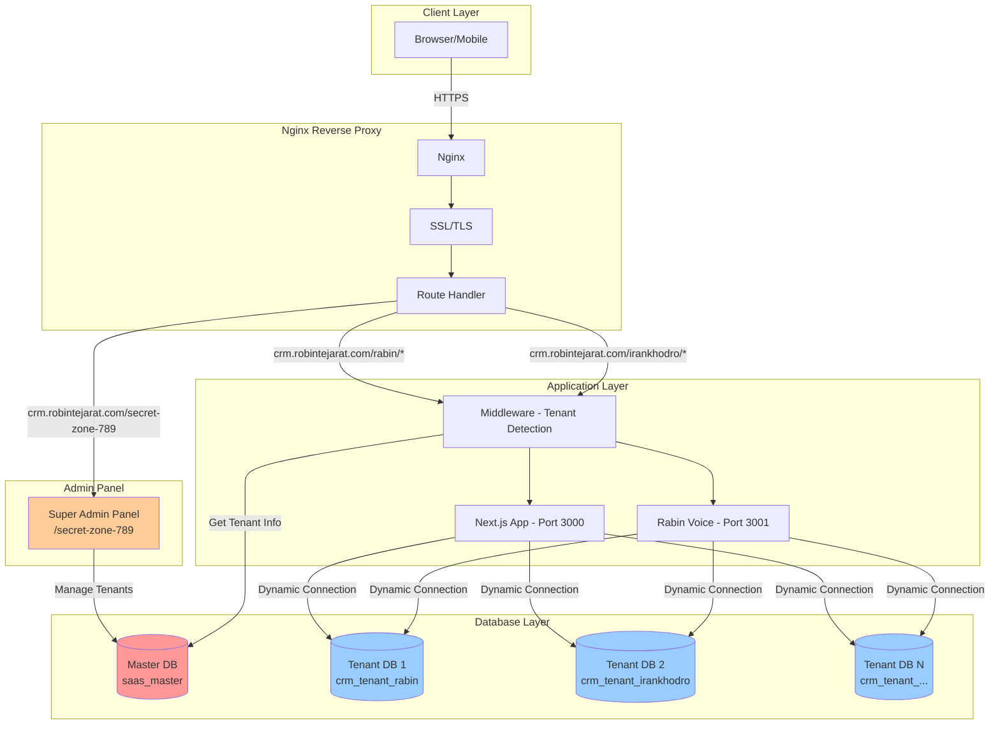
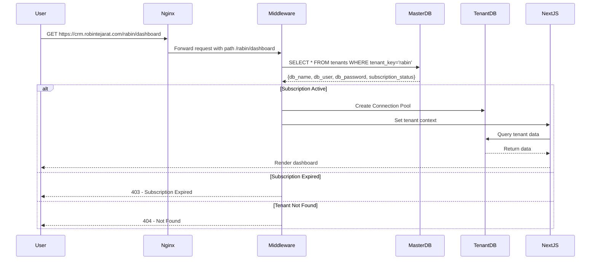

# Design Document

## Overview

این سند طراحی معماری کامل برای تبدیل CRM فعلی به یک سیستم SaaS multi-tenant است. رویکرد اصلی استفاده از **Multiple Databases** است که در آن هر tenant یک دیتابیس جداگانه دارد و یک Master Database برای مدیریت کلی tenants وجود دارد.

### اهداف طراحی

1. **ایزولاسیون کامل داده‌ها**: هر tenant فقط به داده‌های خودش دسترسی دارد
2. **عدم تغییر ساختار موجود**: ۷۰ جدول فعلی بدون تغییر باقی می‌مانند
3. **مقیاس‌پذیری**: امکان افزودن tenant‌های جدید بدون محدودیت
4. **امنیت بالا**: جداسازی کامل در سطح دیتابیس
5. **مدیریت آسان**: پنل مدیریت یکپارچه برای Super Admin
6. **دسترسی از طریق Route**: هر tenant از طریق `/{tenant_key}/*` دسترسی دارد (نه subdomain)

### مزایای رویکرد Multiple Databases

- ایزولاسیون کامل داده‌ها در سطح دیتابیس
- امکان backup و restore مستقل برای هر tenant
- عدم نیاز به تغییر queries موجود
- امکان migration آسان‌تر
- بهبود performance (هر tenant connection pool جداگانه دارد)

### معایب و راه‌حل‌ها

- **مدیریت چندین دیتابیس**: استفاده از اسکریپت‌های خودکار
- **Migration**: اسکریپت یکپارچه برای اعمال تغییرات روی همه tenants
- **Backup**: اسکریپت خودکار برای backup روزانه

## Architecture

### معماری کلی سیستم




### جریان درخواست (Request Flow)




## Components and Interfaces

### 1. Master Database Schema

#### جدول `tenants`


```sql
CREATE TABLE tenants (
    id INT AUTO_INCREMENT PRIMARY KEY,
    tenant_key VARCHAR(50) UNIQUE NOT NULL,
    company_name VARCHAR(255) NOT NULL,
    
    -- Database Connection Info
    db_name VARCHAR(100) UNIQUE NOT NULL,
    db_host VARCHAR(255) DEFAULT 'mysql',
    db_port INT DEFAULT 3306,
    db_user VARCHAR(100) NOT NULL,
    db_password VARCHAR(255) NOT NULL, -- Encrypted
    
    -- Contact Info
    admin_name VARCHAR(255),
    admin_email VARCHAR(255) NOT NULL,
    admin_phone VARCHAR(20),
    
    -- Subscription
    subscription_status ENUM('active', 'expired', 'suspended', 'trial') DEFAULT 'trial',
    subscription_plan ENUM('basic', 'professional', 'enterprise', 'custom') DEFAULT 'basic',
    subscription_start DATE,
    subscription_end DATE,
    
    -- Limits
    max_users INT DEFAULT 10,
    max_customers INT DEFAULT 1000,
    max_storage_mb INT DEFAULT 1024,
    
    -- Features (JSON)
    features JSON,
    
    -- Status
    is_active BOOLEAN DEFAULT TRUE,
    is_deleted BOOLEAN DEFAULT FALSE,
    
    created_at TIMESTAMP DEFAULT CURRENT_TIMESTAMP,
    updated_at TIMESTAMP DEFAULT CURRENT_TIMESTAMP ON UPDATE CURRENT_TIMESTAMP,
    
    INDEX idx_tenant_key (tenant_key),
    INDEX idx_subscription_status (subscription_status)
);
```

### 2. Middleware - Tenant Detection


```typescript
// middleware.ts
import { NextResponse } from 'next/server';
import type { NextRequest } from 'next/server';

export async function middleware(request: NextRequest) {
  const { pathname } = request.nextUrl;
  
  // Skip middleware for admin panel
  if (pathname.startsWith('/secret-zone-789')) {
    return NextResponse.next();
  }
  
  // Extract tenant_key from path: /rabin/dashboard -> rabin
  const tenantKeyMatch = pathname.match(/^\/([^\/]+)/);
  if (!tenantKeyMatch) {
    return NextResponse.redirect(new URL('/404', request.url));
  }
  
  const tenantKey = tenantKeyMatch[1];
  
  // Get tenant info from master database
  const tenant = await getTenantInfo(tenantKey);
  
  if (!tenant || !tenant.is_active) {
    return NextResponse.redirect(new URL('/404', request.url));
  }
  
  if (tenant.subscription_status === 'expired') {
    return NextResponse.redirect(new URL('/subscription-expired', request.url));
  }
  
  if (tenant.subscription_status === 'suspended') {
    return NextResponse.redirect(new URL('/account-suspended', request.url));
  }
  
  // Add tenant info to headers
  const response = NextResponse.next();
  response.headers.set('X-Tenant-Key', tenantKey);
  response.headers.set('X-Tenant-DB', tenant.db_name);
  
  return response;
}

export const config = {
  matcher: ['/((?!api|_next/static|_next/image|favicon.ico).*)'],
};
```

### 3. Dynamic Database Connection


```typescript
// lib/tenant-database.ts
import mysql from 'mysql2/promise';

// Connection pool cache for each tenant
const connectionPools = new Map<string, mysql.Pool>();

interface TenantConfig {
  db_name: string;
  db_host: string;
  db_port: number;
  db_user: string;
  db_password: string;
}

export async function getTenantConnection(tenantKey: string): Promise<mysql.Pool> {
  // Check if pool already exists
  if (connectionPools.has(tenantKey)) {
    return connectionPools.get(tenantKey)!;
  }
  
  // Get tenant config from master database
  const tenantConfig = await getTenantConfigFromMaster(tenantKey);
  
  if (!tenantConfig) {
    throw new Error(`Tenant ${tenantKey} not found`);
  }
  
  // Decrypt password
  const decryptedPassword = decryptPassword(tenantConfig.db_password);
  
  // Create new connection pool
  const pool = mysql.createPool({
    host: tenantConfig.db_host,
    port: tenantConfig.db_port,
    user: tenantConfig.db_user,
    password: decryptedPassword,
    database: tenantConfig.db_name,
    waitForConnections: true,
    connectionLimit: 10,
    queueLimit: 0,
    charset: 'utf8mb4'
  });
  
  // Cache the pool
  connectionPools.set(tenantKey, pool);
  
  return pool;
}

async function getTenantConfigFromMaster(tenantKey: string): Promise<TenantConfig | null> {
  const masterPool = getMasterDatabasePool();
  const [rows] = await masterPool.query(
    'SELECT db_name, db_host, db_port, db_user, db_password FROM tenants WHERE tenant_key = ? AND is_active = 1',
    [tenantKey]
  );
  
  if (Array.isArray(rows) && rows.length > 0) {
    return rows[0] as TenantConfig;
  }
  
  return null;
}
```

### 4. Admin Panel Components

#### Dashboard Stats Component


```typescript
// app/secret-zone-789/admin-panel/components/TenantManagement.tsx
interface Tenant {
  id: number;
  tenant_key: string;
  company_name: string;
  admin_email: string;
  subscription_status: 'active' | 'expired' | 'suspended' | 'trial';
  subscription_end: string;
  subscription_plan: string;
  created_at: string;
}

export default function TenantManagement() {
  const [tenants, setTenants] = useState<Tenant[]>([]);
  const [showAddForm, setShowAddForm] = useState(false);
  
  const loadTenants = async () => {
    const response = await fetch('/api/admin/tenants');
    const data = await response.json();
    setTenants(data.tenants);
  };
  
  const handleAddTenant = async (formData: any) => {
    const response = await fetch('/api/admin/tenants', {
      method: 'POST',
      headers: { 'Content-Type': 'application/json' },
      body: JSON.stringify(formData)
    });
    
    if (response.ok) {
      toast.success('Tenant جدید با موفقیت ایجاد شد');
      loadTenants();
      setShowAddForm(false);
    }
  };
  
  return (
    <div>
      <div className="flex justify-between items-center mb-6">
        <h2 className="text-2xl font-bold">مدیریت Tenants</h2>
        <button onClick={() => setShowAddForm(true)}>
          افزودن Tenant جدید
        </button>
      </div>
      
      <table className="w-full">
        <thead>
          <tr>
            <th>Tenant Key</th>
            <th>نام شرکت</th>
            <th>وضعیت</th>
            <th>تاریخ انقضا</th>
            <th>URL دسترسی</th>
            <th>عملیات</th>
          </tr>
        </thead>
        <tbody>
          {tenants.map(tenant => (
            <tr key={tenant.id}>
              <td>{tenant.tenant_key}</td>
              <td>{tenant.company_name}</td>
              <td>
                <StatusBadge status={tenant.subscription_status} />
              </td>
              <td>{tenant.subscription_end}</td>
              <td>
                <a href={`https://crm.robintejarat.com/${tenant.tenant_key}/dashboard`} 
                   target="_blank" 
                   className="text-blue-600">
                  /{tenant.tenant_key}/dashboard
                </a>
              </td>
              <td>
                <button onClick={() => handleEdit(tenant)}>ویرایش</button>
                <button onClick={() => handleSuspend(tenant)}>تعلیق</button>
              </td>
            </tr>
          ))}
        </tbody>
      </table>
      
      {showAddForm && (
        <AddTenantModal 
          onClose={() => setShowAddForm(false)}
          onSubmit={handleAddTenant}
        />
      )}
    </div>
  );
}
```

## Data Models

### Master Database Models


#### Tenant Model
```typescript
interface Tenant {
  id: number;
  tenant_key: string;
  company_name: string;
  db_name: string;
  db_host: string;
  db_port: number;
  db_user: string;
  db_password: string; // Encrypted
  admin_name: string;
  admin_email: string;
  admin_phone: string;
  subscription_status: 'active' | 'expired' | 'suspended' | 'trial';
  subscription_plan: 'basic' | 'professional' | 'enterprise' | 'custom';
  subscription_start: Date;
  subscription_end: Date;
  max_users: number;
  max_customers: number;
  max_storage_mb: number;
  features: {
    voice_assistant: boolean;
    advanced_reports: boolean;
    api_access: boolean;
    custom_integration: boolean;
    priority_support: boolean;
  };
  settings: Record<string, any>;
  is_active: boolean;
  is_deleted: boolean;
  created_at: Date;
  updated_at: Date;
}
```

#### Subscription Plan Model
```typescript
interface SubscriptionPlan {
  id: number;
  plan_key: string;
  plan_name: string;
  plan_name_en: string;
  price_monthly: number;
  price_yearly: number;
  max_users: number;
  max_customers: number;
  max_storage_mb: number;
  features: {
    voice_assistant: boolean;
    advanced_reports: boolean;
    api_access: boolean;
    custom_integration: boolean;
    priority_support: boolean;
  };
  description: string;
  is_active: boolean;
  created_at: Date;
}
```

## Error Handling

### Error Types


1. **TenantNotFoundError**: Tenant با tenant_key مشخص یافت نشد
2. **SubscriptionExpiredError**: اشتراک tenant منقضی شده
3. **TenantSuspendedError**: Tenant تعلیق شده است
4. **DatabaseConnectionError**: خطا در اتصال به دیتابیس tenant
5. **TenantLimitExceededError**: Tenant به حداکثر محدودیت رسیده (users, customers, storage)
6. **InvalidTenantKeyError**: tenant_key نامعتبر است (فرمت اشتباه)
7. **DuplicateTenantKeyError**: tenant_key تکراری است

### Error Handling Strategy

```typescript
// middleware.ts - Error handling
export async function middleware(request: NextRequest) {
  try {
    const tenantKey = extractTenantKey(request.nextUrl.pathname);
    
    if (!tenantKey || !isValidTenantKey(tenantKey)) {
      return NextResponse.redirect(new URL('/404', request.url));
    }
    
    const tenant = await getTenantInfo(tenantKey);
    
    if (!tenant) {
      return NextResponse.redirect(new URL('/tenant-not-found', request.url));
    }
    
    if (!tenant.is_active) {
      return NextResponse.redirect(new URL('/account-inactive', request.url));
    }
    
    if (tenant.subscription_status === 'expired') {
      return NextResponse.redirect(new URL(`/${tenantKey}/subscription-expired`, request.url));
    }
    
    if (tenant.subscription_status === 'suspended') {
      return NextResponse.redirect(new URL(`/${tenantKey}/account-suspended`, request.url));
    }
    
    // Add tenant context to request
    const response = NextResponse.next();
    response.headers.set('X-Tenant-Key', tenantKey);
    response.headers.set('X-Tenant-DB', tenant.db_name);
    
    return response;
    
  } catch (error) {
    console.error('Middleware error:', error);
    return NextResponse.redirect(new URL('/error', request.url));
  }
}

function isValidTenantKey(key: string): boolean {
  // Only lowercase letters, numbers, and hyphens
  return /^[a-z0-9-]+$/.test(key);
}

function extractTenantKey(pathname: string): string | null {
  // Extract from /{tenant_key}/...
  const match = pathname.match(/^\/([^\/]+)/);
  
  // Exclude admin panel and static routes
  if (match && !['secret-zone-789', 'api', '_next', 'static'].includes(match[1])) {
    return match[1];
  }
  
  return null;
}
```

## Testing Strategy


### Unit Tests

1. **Middleware Tests**
   - تست استخراج tenant_key از URL
   - تست اعتبارسنجی tenant_key
   - تست redirect برای tenant نامعتبر
   - تست redirect برای اشتراک منقضی شده

2. **Database Connection Tests**
   - تست ایجاد connection pool
   - تست cache کردن connection
   - تست decrypt کردن password
   - تست خطای اتصال

3. **Admin Panel Tests**
   - تست ایجاد tenant جدید
   - تست اعتبارسنجی فرم
   - تست تمدید اشتراک
   - تست تعلیق/فعال‌سازی tenant

### Integration Tests

1. **End-to-End Tenant Creation**
   - ایجاد tenant از پنل admin
   - بررسی ایجاد دیتابیس
   - بررسی ایجاد کاربر دیتابیس
   - تست لاگین به tenant جدید

2. **Multi-Tenant Isolation**
   - ایجاد 2 tenant مختلف
   - اضافه کردن داده به هر tenant
   - بررسی عدم دسترسی tenant A به داده‌های tenant B

3. **Subscription Management**
   - تست منقضی شدن اشتراک
   - تست تمدید اشتراک
   - تست تعلیق tenant

### Manual Testing Checklist

- [ ] ایجاد tenant جدید از پنل admin
- [ ] لاگین به tenant با URL: `https://crm.robintejarat.com/{tenant_key}/login`
- [ ] دسترسی به داشبورد: `https://crm.robintejarat.com/{tenant_key}/dashboard`
- [ ] استفاده از دستیار صوتی در tenant
- [ ] اضافه کردن مشتری در tenant
- [ ] بررسی ایزولاسیون داده‌ها بین 2 tenant
- [ ] تست منقضی شدن اشتراک
- [ ] تست تعلیق tenant
- [ ] تست تمدید اشتراک

## Security Considerations


### 1. Database Password Encryption

```typescript
// lib/encryption.ts
import crypto from 'crypto';

const ENCRYPTION_KEY = process.env.DB_ENCRYPTION_KEY!; // 32 bytes
const ALGORITHM = 'aes-256-gcm';

export function encryptPassword(password: string): string {
  const iv = crypto.randomBytes(16);
  const cipher = crypto.createCipheriv(ALGORITHM, Buffer.from(ENCRYPTION_KEY, 'hex'), iv);
  
  let encrypted = cipher.update(password, 'utf8', 'hex');
  encrypted += cipher.final('hex');
  
  const authTag = cipher.getAuthTag();
  
  // Return: iv:authTag:encrypted
  return `${iv.toString('hex')}:${authTag.toString('hex')}:${encrypted}`;
}

export function decryptPassword(encryptedData: string): string {
  const [ivHex, authTagHex, encrypted] = encryptedData.split(':');
  
  const iv = Buffer.from(ivHex, 'hex');
  const authTag = Buffer.from(authTagHex, 'hex');
  const decipher = crypto.createDecipheriv(ALGORITHM, Buffer.from(ENCRYPTION_KEY, 'hex'), iv);
  
  decipher.setAuthTag(authTag);
  
  let decrypted = decipher.update(encrypted, 'hex', 'utf8');
  decrypted += decipher.final('utf8');
  
  return decrypted;
}
```

### 2. SQL Injection Prevention

- استفاده از Prepared Statements در تمام queries
- اعتبارسنجی tenant_key قبل از استفاده در queries
- محدود کردن کاراکترهای مجاز در tenant_key

### 3. Session Management

```typescript
// lib/tenant-session.ts
import jwt from 'jsonwebtoken';

interface TenantSession {
  userId: number;
  tenantKey: string;
  email: string;
  role: string;
}

export function createTenantSession(data: TenantSession): string {
  return jwt.sign(data, process.env.JWT_SECRET!, {
    expiresIn: '8h',
    issuer: 'crm-saas'
  });
}

export function verifyTenantSession(token: string, expectedTenantKey: string): TenantSession | null {
  try {
    const decoded = jwt.verify(token, process.env.JWT_SECRET!) as TenantSession;
    
    // Verify tenant_key matches
    if (decoded.tenantKey !== expectedTenantKey) {
      return null;
    }
    
    return decoded;
  } catch (error) {
    return null;
  }
}
```

### 4. Rate Limiting

```typescript
// middleware.ts - Add rate limiting
import { RateLimiter } from 'limiter';

const limiters = new Map<string, RateLimiter>();

function getRateLimiter(tenantKey: string): RateLimiter {
  if (!limiters.has(tenantKey)) {
    // 100 requests per minute per tenant
    limiters.set(tenantKey, new RateLimiter({ tokensPerInterval: 100, interval: 'minute' }));
  }
  return limiters.get(tenantKey)!;
}
```

### 5. Admin Panel Security

- احراز هویت دو مرحله‌ای برای Super Admin
- لاگ تمام عملیات admin در `tenant_activity_logs`
- محدود کردن IP برای دسترسی به پنل admin (اختیاری)
- Session timeout کوتاه (1 ساعت)

## Deployment Architecture


### Docker Compose Configuration

```yaml
version: '3.8'

services:
  # MySQL Master Database
  mysql-master:
    image: mariadb:10.4.32
    container_name: crm-mysql-master
    environment:
      MYSQL_ROOT_PASSWORD: "${MASTER_DB_PASSWORD}"
      MYSQL_DATABASE: "saas_master"
    volumes:
      - mysql_master_data:/var/lib/mysql
      - ./database/saas-master-schema.sql:/docker-entrypoint-initdb.d/01-schema.sql
    networks:
      - crm-network
    healthcheck:
      test: ["CMD", "mariadb-admin", "ping", "-h", "localhost"]
      interval: 10s
      timeout: 5s
      retries: 5

  # MySQL for Tenants (shared server, multiple databases)
  mysql-tenants:
    image: mariadb:10.4.32
    container_name: crm-mysql-tenants
    environment:
      MYSQL_ROOT_PASSWORD: "${TENANTS_DB_PASSWORD}"
    volumes:
      - mysql_tenants_data:/var/lib/mysql
      - ./database/tenant-template.sql:/docker-entrypoint-initdb.d/template.sql
    networks:
      - crm-network
    healthcheck:
      test: ["CMD", "mariadb-admin", "ping", "-h", "localhost"]
      interval: 10s
      timeout: 5s
      retries: 5

  # Next.js Application
  nextjs:
    build: .
    container_name: crm-nextjs
    environment:
      - NODE_ENV=production
      - MASTER_DB_HOST=mysql-master
      - TENANTS_DB_HOST=mysql-tenants
      - DB_ENCRYPTION_KEY=${DB_ENCRYPTION_KEY}
    depends_on:
      mysql-master:
        condition: service_healthy
      mysql-tenants:
        condition: service_healthy
    networks:
      - crm-network

  # Rabin Voice
  rabin-voice:
    build: ./صدای رابین
    container_name: crm-rabin-voice
    environment:
      - MASTER_DB_HOST=mysql-master
      - TENANTS_DB_HOST=mysql-tenants
    depends_on:
      - mysql-master
      - mysql-tenants
    networks:
      - crm-network

  # Nginx
  nginx:
    image: nginx:alpine
    container_name: crm-nginx
    ports:
      - "80:80"
      - "443:443"
    volumes:
      - ./nginx/saas.conf:/etc/nginx/conf.d/default.conf
      - /etc/letsencrypt:/etc/letsencrypt:ro
    depends_on:
      - nextjs
      - rabin-voice
    networks:
      - crm-network

volumes:
  mysql_master_data:
  mysql_tenants_data:

networks:
  crm-network:
    driver: bridge
```

### Nginx Configuration for Routes

```nginx
# nginx/saas.conf
server {
    listen 80;
    server_name crm.robintejarat.com;
    
    # Redirect to HTTPS
    return 301 https://$server_name$request_uri;
}

server {
    listen 443 ssl http2;
    server_name crm.robintejarat.com;
    
    ssl_certificate /etc/letsencrypt/live/crm.robintejarat.com/fullchain.pem;
    ssl_certificate_key /etc/letsencrypt/live/crm.robintejarat.com/privkey.pem;
    
    # Admin Panel
    location /secret-zone-789 {
        proxy_pass http://nextjs:3000;
        proxy_set_header Host $host;
        proxy_set_header X-Real-IP $remote_addr;
        proxy_set_header X-Forwarded-For $proxy_add_x_forwarded_for;
        proxy_set_header X-Forwarded-Proto $scheme;
    }
    
    # Rabin Voice API
    location /rabin-voice {
        proxy_pass http://rabin-voice:3001;
        proxy_set_header Host $host;
        proxy_set_header X-Real-IP $remote_addr;
    }
    
    # Tenant Routes (/{tenant_key}/*)
    location ~ ^/([a-z0-9-]+)/ {
        proxy_pass http://nextjs:3000;
        proxy_set_header Host $host;
        proxy_set_header X-Real-IP $remote_addr;
        proxy_set_header X-Forwarded-For $proxy_add_x_forwarded_for;
        proxy_set_header X-Forwarded-Proto $scheme;
        
        # Extract tenant_key and pass as header
        set $tenant_key $1;
        proxy_set_header X-Tenant-Key $tenant_key;
    }
    
    # Static files
    location /_next/static {
        proxy_pass http://nextjs:3000;
        proxy_cache_valid 200 60m;
    }
}
```

## Performance Optimization


### 1. Connection Pool Caching

- هر tenant یک connection pool اختصاصی دارد که cache می‌شود
- Connection pool با LRU eviction برای جلوگیری از memory leak
- حداکثر 10 connection به ازای هر tenant

### 2. Tenant Info Caching

```typescript
// lib/tenant-cache.ts
import { LRUCache } from 'lru-cache';

interface TenantInfo {
  tenant_key: string;
  db_name: string;
  subscription_status: string;
  features: any;
}

const tenantCache = new LRUCache<string, TenantInfo>({
  max: 100, // Maximum 100 tenants in cache
  ttl: 1000 * 60 * 5, // 5 minutes TTL
});

export async function getCachedTenantInfo(tenantKey: string): Promise<TenantInfo | null> {
  // Check cache first
  const cached = tenantCache.get(tenantKey);
  if (cached) {
    return cached;
  }
  
  // Fetch from database
  const tenantInfo = await fetchTenantFromMaster(tenantKey);
  
  if (tenantInfo) {
    tenantCache.set(tenantKey, tenantInfo);
  }
  
  return tenantInfo;
}

export function invalidateTenantCache(tenantKey: string) {
  tenantCache.delete(tenantKey);
}
```

### 3. Database Indexing

- Index روی `tenant_key` در جدول `tenants`
- Index روی `subscription_status` برای query سریع tenants فعال
- Index روی `subscription_end` برای پیدا کردن tenants منقضی شده

### 4. Query Optimization

- استفاده از SELECT فقط فیلدهای مورد نیاز
- Pagination برای لیست tenants در admin panel
- Lazy loading برای جزئیات tenant

## Monitoring and Logging


### Logging Strategy

```typescript
// lib/tenant-logger.ts
import fs from 'fs';
import path from 'path';

interface LogEntry {
  timestamp: string;
  level: 'info' | 'warn' | 'error';
  tenantKey: string;
  action: string;
  details: any;
  userId?: number;
  ip?: string;
}

export function logTenantActivity(entry: LogEntry) {
  // Log to file
  const logDir = path.join(process.cwd(), 'logs', 'tenants');
  if (!fs.existsSync(logDir)) {
    fs.mkdirSync(logDir, { recursive: true });
  }
  
  const logFile = path.join(logDir, `${entry.tenantKey}.log`);
  const logLine = JSON.stringify(entry) + '\n';
  
  fs.appendFileSync(logFile, logLine);
  
  // Also log to database
  logToDatabase(entry);
}

async function logToDatabase(entry: LogEntry) {
  const masterPool = getMasterDatabasePool();
  
  await masterPool.query(
    `INSERT INTO tenant_activity_logs 
     (tenant_id, activity_type, description, metadata, performed_by, ip_address) 
     VALUES (
       (SELECT id FROM tenants WHERE tenant_key = ?),
       ?, ?, ?, ?, ?
     )`,
    [
      entry.tenantKey,
      entry.action,
      `${entry.level}: ${entry.action}`,
      JSON.stringify(entry.details),
      entry.userId,
      entry.ip
    ]
  );
}
```

### Metrics to Track

1. **Tenant Metrics**
   - تعداد tenants فعال
   - تعداد tenants جدید در ماه
   - نرخ churn (tenants که اشتراک تمدید نکردند)
   - میانگین عمر اشتراک

2. **Performance Metrics**
   - زمان پاسخ middleware
   - زمان اتصال به دیتابیس tenant
   - تعداد connection pools فعال
   - استفاده از حافظه

3. **Business Metrics**
   - درآمد ماهانه/سالانه
   - توزیع tenants بر اساس پلن
   - استفاده از ویژگی‌ها (voice assistant, reports, etc.)

## Migration Strategy


### Phase 1: Setup Master Database

1. ایجاد دیتابیس `saas_master`
2. اجرای schema برای جداول master
3. ایجاد super admin پیش‌فرض
4. ایجاد پلن‌های پیش‌فرض

### Phase 2: Implement Middleware

1. ایجاد middleware برای tenant detection
2. پیاده‌سازی dynamic database connection
3. تست با یک tenant نمونه

### Phase 3: Upgrade Admin Panel

1. اتصال پنل admin به `saas_master`
2. پیاده‌سازی فرم ایجاد tenant
3. پیاده‌سازی لیست و مدیریت tenants
4. پیاده‌سازی مدیریت اشتراک‌ها

### Phase 4: Create Tenant Database Script

1. اسکریپت ایجاد دیتابیس جدید
2. اسکریپت کپی ساختار از template
3. اسکریپت ایجاد کاربر دیتابیس
4. تست end-to-end

### Phase 5: Update Existing Routes

1. تغییر route structure به `/{tenant_key}/*`
2. به‌روزرسانی authentication برای tenant-specific sessions
3. به‌روزرسانی Rabin Voice برای tenant isolation

### Phase 6: Testing & Deployment

1. تست با 3-5 tenant نمونه
2. تست ایزولاسیون داده‌ها
3. تست performance
4. Deploy به production

## Backup and Disaster Recovery


### Backup Strategy

```bash
#!/bin/bash
# scripts/backup-all-tenants.sh

BACKUP_DIR="/backups/tenants"
DATE=$(date +%Y%m%d_%H%M%S)

# Backup master database
mysqldump -h mysql-master -u root -p${MASTER_DB_PASSWORD} saas_master > "${BACKUP_DIR}/master_${DATE}.sql"

# Get all tenant databases
TENANTS=$(mysql -h mysql-master -u root -p${MASTER_DB_PASSWORD} -N -e "SELECT db_name FROM saas_master.tenants WHERE is_active=1")

# Backup each tenant database
for DB in $TENANTS; do
    echo "Backing up $DB..."
    mysqldump -h mysql-tenants -u root -p${TENANTS_DB_PASSWORD} $DB > "${BACKUP_DIR}/${DB}_${DATE}.sql"
done

# Compress backups
tar -czf "${BACKUP_DIR}/all_tenants_${DATE}.tar.gz" ${BACKUP_DIR}/*_${DATE}.sql

# Remove old backups (older than 30 days)
find ${BACKUP_DIR} -name "*.sql" -mtime +30 -delete
find ${BACKUP_DIR} -name "*.tar.gz" -mtime +30 -delete

echo "Backup completed: all_tenants_${DATE}.tar.gz"
```

### Restore Strategy

```bash
#!/bin/bash
# scripts/restore-tenant.sh

TENANT_KEY=$1
BACKUP_FILE=$2

if [ -z "$TENANT_KEY" ] || [ -z "$BACKUP_FILE" ]; then
    echo "Usage: ./restore-tenant.sh <tenant_key> <backup_file>"
    exit 1
fi

# Get database name from master
DB_NAME=$(mysql -h mysql-master -u root -p${MASTER_DB_PASSWORD} -N -e "SELECT db_name FROM saas_master.tenants WHERE tenant_key='${TENANT_KEY}'")

if [ -z "$DB_NAME" ]; then
    echo "Tenant not found: $TENANT_KEY"
    exit 1
fi

echo "Restoring $DB_NAME from $BACKUP_FILE..."

# Drop and recreate database
mysql -h mysql-tenants -u root -p${TENANTS_DB_PASSWORD} -e "DROP DATABASE IF EXISTS ${DB_NAME}"
mysql -h mysql-tenants -u root -p${TENANTS_DB_PASSWORD} -e "CREATE DATABASE ${DB_NAME} CHARACTER SET utf8mb4 COLLATE utf8mb4_unicode_ci"

# Restore from backup
mysql -h mysql-tenants -u root -p${TENANTS_DB_PASSWORD} ${DB_NAME} < ${BACKUP_FILE}

echo "Restore completed for $TENANT_KEY"
```

## Scalability Considerations

### Horizontal Scaling

1. **Database Sharding**: در صورت رشد زیاد، می‌توان tenants را بین چند MySQL server توزیع کرد
2. **Load Balancing**: استفاده از Nginx load balancer برای توزیع ترافیک بین چند Next.js instance
3. **Caching Layer**: استفاده از Redis برای cache کردن tenant info و session data

### Vertical Scaling

1. افزایش منابع MySQL server (CPU, RAM, Storage)
2. افزایش connection pool size
3. بهینه‌سازی queries و indexes

## Summary

این طراحی یک معماری کامل SaaS multi-tenant با رویکرد Multiple Databases ارائه می‌دهد که:

✅ **ایزولاسیون کامل**: هر tenant دیتابیس جداگانه دارد
✅ **بدون تغییر ساختار**: ۷۰ جدول فعلی بدون تغییر باقی می‌مانند
✅ **Route-based Access**: دسترسی از طریق `/{tenant_key}/*` (نه subdomain)
✅ **امنیت بالا**: encryption، session management، rate limiting
✅ **مقیاس‌پذیر**: امکان افزودن tenant‌های نامحدود
✅ **قابل مدیریت**: پنل admin کامل برای Super Admin
✅ **قابل نگهداری**: logging، monitoring، backup strategy

این طراحی آماده پیاده‌سازی است و تمام requirements را پوشش می‌دهد.
